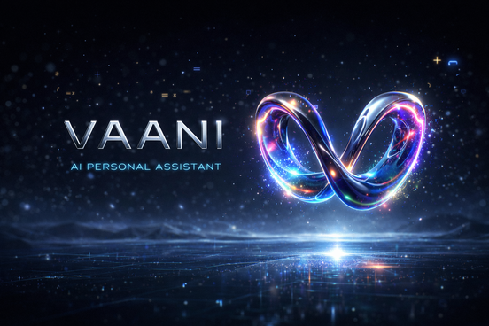

Welcome to Vaani!
=================

Hey there! 👋 I'm Aman Kumar Pandey, and this is **Vaani** - my personal AI voice assistant project.

**Vaani** (वाणी) means "voice" in Hindi. I built this because I wanted a voice assistant that:

- Actually respects your privacy (runs mostly on your computer)
- Works offline when needed
- Supports multiple languages (I speak Hindi and English daily!)
- Is proprietary software (currently not open-source)
- Actually smart conversations (thanks to Google's Gemini AI)

Think of it as your personal assistant that you fully control and understand.

Quick Start
-----------

Want to try it out? Here's the fastest way:

.. code-block:: bash

   # Clone the project
   git clone https://github.com/paman7647/vaani.git
   cd vaani
   
   # Set up (I've made this easy!)
   chmod +x setup.sh
   ./setup.sh
   
   # Run it!
   python3 main.py

Then just say **"Hey Vaani"** and start talking! Pretty simple, right?

Where to Go Next
----------------

- **Never used Vaani?** Start with :doc:`getting_started` - I'll walk you through everything
- **Ready to install?** Check out :doc:`installation` for step-by-step setup
- **Curious how it works?** Read :doc:`architecture` - I explain the tech in simple terms
- **Want to customize?** See :doc:`customization` for all the tweaks you can make

Documentation Guide
-------------------

.. toctree::
   :maxdepth: 2
   :caption: Getting Started

   overview
   getting_started
   installation
   usage
   configuration

.. toctree::
   :maxdepth: 2
   :caption: How It Works

   architecture
   voice_system
   intelligence
   memory_context

.. toctree::
   :maxdepth: 2
   :caption: Make It Yours

   customization
   troubleshooting
   faq

.. toctree::
   :maxdepth: 2
   :caption: For Developers

   development/project_structure
   development/coding_style
   development/contributing

.. toctree::
   :maxdepth: 2
   :caption: Deployment & Performance

   deployment
   performance
   debugging

.. toctree::
   :maxdepth: 1
   :caption: More Info

   credits
   disclaimer
   license

Indices and Tables
==================

* :ref:`genindex`
* :ref:`modindex`
* :ref:`search`
